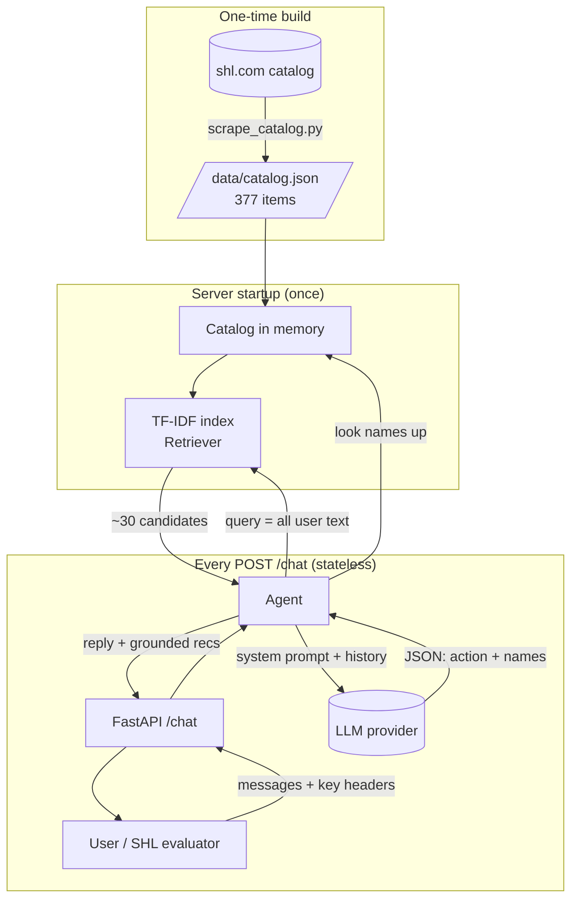

# 2 · Architecture

## The pieces (and which file each one lives in)

| Piece | File | Job |
|-------|------|-----|
| **Scraper** | `scripts/scrape_catalog.py` | One-time: download the SHL catalog → `data/catalog.json` |
| **Catalog** | `app/catalog.py` | Load the 377 assessments into memory; look items up by name |
| **Retriever** | `app/retrieval.py` | TF-IDF search → top ~30 candidate assessments for a query |
| **LLM clients** | `app/llm.py` | Call Groq / Gemini / OpenRouter behind one function |
| **Prompts** | `app/prompts.py` | Build the system prompt (rules + candidate list) |
| **Agent** | `app/agent.py` | Orchestrate everything; ground results; never crash |
| **API** | `app/main.py` | `GET /health`, `POST /chat`, serve the web UI |
| **Schemas** | `app/schemas.py` | Strict request/response shapes (Pydantic) |
| **Config** | `app/config.py` | Settings + resolve which LLM key to use per request |
| **Web UI** | `web/` | Browser chat where you paste your own API key |

## How they connect



## The two-brain design (retrieval + LLM)

The core architectural idea is **separation of "search" from "reasoning"**:

```
            ┌─────────────────────────────────────────────┐
 user text  │  RETRIEVER (TF-IDF, offline, deterministic)  │  ~30 real
 ─────────► │  "which catalog items look relevant?"        │ ─────────► candidates
            └─────────────────────────────────────────────┘
                                                                │
                                                                ▼
            ┌─────────────────────────────────────────────┐
 history +  │  LLM (Groq/Gemini/OpenRouter)                │  action +
 candidates │  "ask? recommend? refine? compare? refuse?   │  chosen names
 ─────────► │   and which candidates actually fit?"        │ ─────────►
            └─────────────────────────────────────────────┘
                                                                │
                                                                ▼
            ┌─────────────────────────────────────────────┐
 names      │  GROUNDING (look each name up in Catalog)    │  final recs with
 ─────────► │  drop anything not in the catalog            │  REAL urls + types
            └─────────────────────────────────────────────┘
```

**Why this matters for scoring:**
- *Hard eval "catalog-only URLs"* → guaranteed, because the final URLs come from
  `catalog.py`, never from the LLM's text.
- *Recall@10* → the retriever surfaces the right items; the LLM refines them.
- *Behaviour probes* → the agent layer enforces "no recs while clarifying",
  "refuse off-topic", "honour the 8-turn cap" regardless of what the LLM says.

## Statelessness

There is **no database and no session memory**. Everything the agent needs is
in the `messages` array sent with each request. Benefits:

- **Horizontally scalable** — any instance can serve any request.
- **Crash-safe** — a restart loses nothing.
- **Matches the spec** — "Every POST /chat call carries the full conversation
  history. Your service stores no per-conversation state."

The only state is **read-only and built once at startup**: the catalog in memory
and the fitted TF-IDF index (rebuilding these per request would be wasteful).

## Where the API key comes from (two paths)

```
Web UI user ──► localStorage ──► X-LLM-Provider / X-LLM-Api-Key headers ─┐
                                                                          ├─► config.resolve_credentials()
SHL evaluator ─► (no headers) ─► server .env (LLM_PROVIDER/LLM_API_KEY) ─┘
```

Request **headers win** over the server env. This lets a user try their own free
key in the browser, while the deployed instance still serves SHL's evaluator
using a server-side key — without ever changing the `/chat` body schema.

➡️ Next: [Request flow](03-request-flow.md) — a single `/chat` call, step by step.
