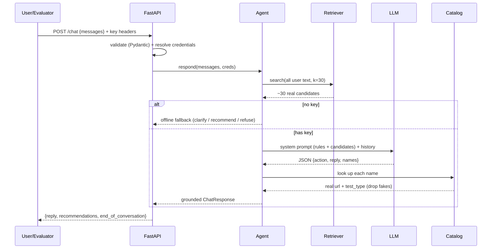

# 3 · Request Flow — what happens on ONE `/chat` call

We follow a single message all the way through the system. Each step has a
**simple** line and an **in-depth** line.

Example request:

```json
POST /chat
{ "messages": [ {"role":"user","content":"Hiring a Java developer who works with stakeholders"} ] }
```
Headers: `X-LLM-Provider: groq`, `X-LLM-Api-Key: gsk_...`

---

## Step 0 — Server startup (happens once, not per request)

- **Simple:** Before serving anyone, the shop loads its notebook and gets the
  Finder ready.
- **In depth:** `app/main.py`'s `lifespan()` runs `Catalog.load()` (reads
  `data/catalog.json` into `Assessment` objects) and builds a `Retriever`, which
  **fits the TF-IDF model** over all 377 documents. Both are cached in `state`
  and reused for every request. *Code:* `main.py:lifespan`.

---

## Step 1 — The door: FastAPI receives and validates

- **Simple:** The doorman checks the envelope is the right shape.
- **In depth:** FastAPI matches `POST /chat` to `chat(...)`. Pydantic parses the
  body into a `ChatRequest` (`schemas.py`). If `messages` is missing/empty or a
  role/content is wrong, FastAPI returns **HTTP 422 automatically** — we never
  see malformed input. The three `X-LLM-*` headers are read as optional strings.
  *Code:* `main.py:chat`, `schemas.py:ChatRequest`.

---

## Step 2 — Resolve credentials: which brain do we use?

- **Simple:** Decide whose AI key to use — the one from the browser, or the
  server's.
- **In depth:** `config.resolve_credentials()` prefers the request **headers**
  (the UI user's key) and falls back to **environment variables** (the deployed
  server's key). It validates the provider name and fills in a default model if
  none was given. Returns an `LLMCredentials` with an `is_usable` flag.
  *Code:* `config.py:resolve_credentials`.

---

## Step 3 — Build the search query from the WHOLE conversation

- **Simple:** Glue together everything the user has said so far.
- **In depth:** `Agent.respond()` concatenates **all `user` messages** into one
  query string. Using the whole history (not just the latest line) means later
  turns like "around 4 years, backend" still steer retrieval. We also grab the
  *latest* user message separately, used only by the offline fallback.
  *Code:* `agent.py:respond`.

---

## Step 4 — Retrieve candidates (offline, deterministic)

- **Simple:** The Finder flips to the ~30 most relevant notebook pages.
- **In depth:** `Retriever.search(query, k=30)` transforms the query with the
  pre-fitted `TfidfVectorizer` and computes **cosine similarity** against the
  377 catalog vectors. It returns the top items with score > 0, best first. Each
  catalog "document" already contains the title (double-weighted), description,
  job levels, and **human-readable test-type words** (so "personality" matches
  P-type items). *Code:* `retrieval.py:search`, `catalog.py:search_document`.

---

## Step 5 — Decide if we're running out of turns

- **Simple:** Check the clock — if we're almost out of time, we must give an
  answer now instead of asking again.
- **In depth:** SHL caps a conversation at **8 messages**. `must_recommend` is
  set when `len(messages) >= MAX_TURNS - 3` (i.e. 5+). It is passed both into the
  prompt (as an instruction) **and** enforced in code later. *Code:*
  `agent.py:respond`.

---

## Step 6 — No usable key? Take the safe offline path

- **Simple:** If there's no AI key, the assistant still helps using just the
  Finder, and politely says replies are basic.
- **In depth:** If `creds.is_usable` is false, `Agent._fallback()` runs:
  refuse on injection/off-topic keywords, **clarify** if the message is too
  vague (few informative words), else **recommend** the top candidates. This
  guarantees the service never returns a broken/empty response just because a
  key is missing. *Code:* `agent.py:_fallback`.

---

## Step 7 — Build the prompt (context engineering)

- **Simple:** Write the AI a short rulebook plus the list of allowed tests.
- **In depth:** `prompts.build_system_prompt(candidates, must_recommend)`
  assembles: (a) the **behaviour policy** (who it is, when to clarify/recommend/
  refine/compare/refuse, hard rules), (b) the **strict JSON output contract**,
  and (c) the **candidate list** — the only assessments the LLM may name. If
  `must_recommend`, it appends a "you must recommend now" instruction.
  *Code:* `prompts.py:build_system_prompt`.

---

## Step 8 — Call the LLM

- **Simple:** Send the rulebook + the chat to the AI and get JSON back.
- **In depth:** `llm.call_llm(creds, system_prompt, messages)` routes to the
  right provider. Groq/OpenRouter use the OpenAI-compatible
  `/chat/completions` with `response_format=json_object`; Gemini uses
  `generateContent` with `response_mime_type=application/json`. Temperature is
  low (0.2) for consistency, and the HTTP timeout (~24s) stays under SHL's 30s
  cap. Network/HTTP errors raise `LLMError`. *Code:* `llm.py`.

The model returns something like:
```json
{ "action":"clarify",
  "reply":"Sure — what seniority level, and what should it measure?",
  "recommendation_names":[],
  "end_of_conversation":false }
```

---

## Step 9 — Parse + ground the response (anti-hallucination)

- **Simple:** Read the AI's answer, and for any test it names, look it up in the
  real notebook. Throw away anything that isn't real.
- **In depth:** `Agent._from_llm()`:
  1. `_extract_json()` robustly pulls the JSON out (handles ```` ```json ````
     fences or stray prose).
  2. Reads `action`, `reply`, `recommendation_names`, `end_of_conversation`.
  3. If `must_recommend` but the model said `clarify`, **override to recommend**.
  4. `_ground()` maps each name through `Catalog.get()` (normalised match);
     **unknown names are silently dropped**, and the real `url` + `test_type`
     are attached. De-duplicates by URL.
  5. Enforces the rules: `clarify`/`refuse` → recommendations forced empty;
     `recommend`/`refine`/`compare` → if the LLM gave no valid names, **rescue**
     with the top retrieved candidates. Clamp to ≤10.
  *Code:* `agent.py:_from_llm`, `_ground`, `_extract_json`.

This is where "every URL comes from the catalog" is **guaranteed in code**, not
hoped for in a prompt.

---

## Step 10 — Return the strict response

- **Simple:** Put the answer back in the exact envelope and hand it over.
- **In depth:** A `ChatResponse` is returned; FastAPI serialises it to exactly
  `{reply, recommendations[], end_of_conversation}`. If *anything* unexpected
  threw along the way, the global exception handler in `main.py` still returns a
  **schema-valid 200** on `/chat` — the conversation never 500s. *Code:*
  `main.py:chat`, `main.py:unhandled`.

---

## The same flow, as a sequence



➡️ Next: [Dependencies](04-dependencies.md) — every library and why it's here.
